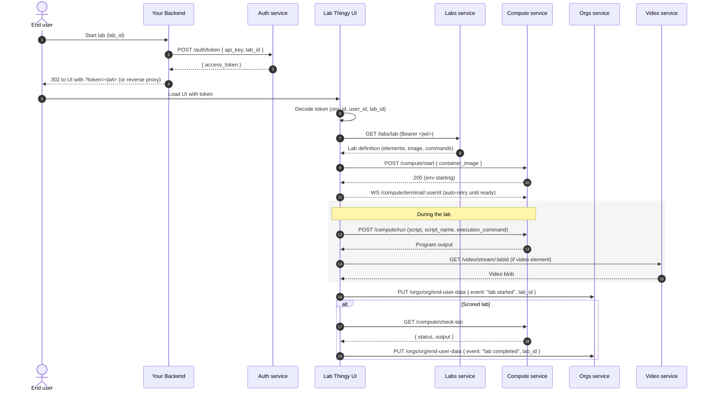

High‑level flow from a user click (or redirect) to an interactive container.

## Auth (Launch Tokens)

- Exchange `{ api_key, lab_id }` → short‑lived JWT (`POST /auth/token`)
- Embed modal path auto‑mints a lab‑scoped token via `POST /auth/embed/token`
- Claims: `org_id`, `user_id`, `lab_id` (minimal & time‑boxed)
- Admin portal uses Auth0 (RS256) — separate from end‑user HS256 token

## Compute (Ephemeral Container)

- One container per active user session (preset or custom image)
- Terminal (WebSocket) attaches after readiness; retries while starting
- Run endpoint executes provided script within that container
- Optional scoring endpoint runs validation & returns result

## UI Data Flow

1. Token presented (query, fragment, Authorization header, or embed)  
2. Lab definition fetched (elements: text, IDE, terminal, video, scoring)  
3. Compute start requested; terminal begins auto‑retry loop  
4. User runs code / interacts; events may be logged for analytics (privacy aware)  
5. (If video) streamed on demand  
6. (If scoring) check endpoint returns pass/fail + feedback  

## Security & Isolation (Surface Level)

- Short JWT TTLs; scope limited to one lab
- Non‑root container per user (see “Environment Isolation & Safeguards”)
- No org API key in browser; server mints tokens
- Recommended: reverse proxy in production, links/embeds for trials & marketing

### Sequence (high‑level)

